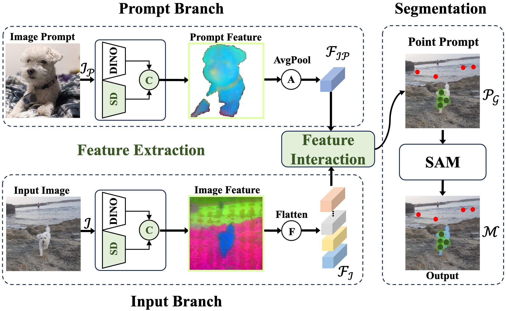
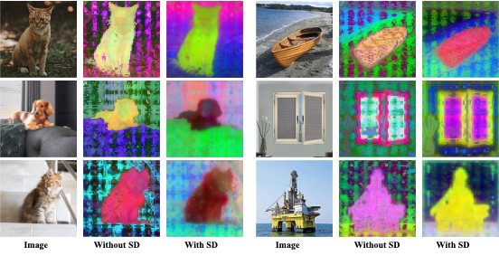

## IJCV2024: Towards Training-free Open-world Segmentation via Image Prompt Foundation Models

This repository is the official PyTorch implementation of our IPSeg framework. [[arXiv](https://arxiv.org/abs/2310.10912)]
<div align="center">

</div>

## Abstract

The realm of computer vision has witnessed a paradigm shift with the advent of foundational models, mirroring the transformative influence of large language models in the domain of natural language processing. This paper delves into the exploration of open-world segmentation, presenting a novel approach called Image Prompt Segmentation (IPSeg) that harnesses the power of vision foundational models. IPSeg lies the principle of a training-free paradigm, which capitalizes on image prompt techniques. Specifically, IPSeg utilizes a single image containing a subjective visual concept as a flexible prompt to query vision foundation models like DINOv2 and Stable Diffusion. Our approach extracts robust features for the prompt image and input image, then matches the input representations to the prompt representations via a novel feature interaction module to generate point prompts highlighting target objects in the input image. The generated point prompts are further utilized to guide the Segment Anything Model to segment the target object in the input image. The proposed method stands out by eliminating the need for exhaustive training sessions, thereby offering a more efficient and scalable solution. Experiments on COCO, PASCAL VOC, and other datasets demonstrate IPSeg's efficacy for flexible open-world segmentation using intuitive image prompts. This work pioneers tapping foundation models for open-world understanding through visual concepts conveyed in images.

## News
- [x] [2024.07.16] Paper is accepted by IJCV and GitHub repo is created.

## Visual Results
### Segmention Visualization
<div align="center">

</div>

### SD-DINO Visualization
<div align="center">

</div>


## Environment Setup
To install the required dependencies, use the following commands:

```bash
conda create -n ipseg python=3.9
conda activate ipseg
conda install pytorch=1.13.1 torchvision=0.14.1 pytorch-cuda=11.6 -c pytorch -c nvidia
conda install -c "nvidia/label/cuda-11.6.1" libcusolver-dev
git clone git@github.com:luckybird1994/IPSeg.git
cd IPSeg
pip install -e .
```

## Get Started

1. Download the [PerSeg Dataset](https://huggingface.co/datasets/xhk/IPSeg-Datasets/tree/main) and [Checkpoint](https://huggingface.co/xhk/IPSeg/tree/main).
2. Get the saliency maps of PerSeg dataset by:
```bash
sh scripts/perseg_sod.sh
```
3. Get the Stable&DINOv2 features of PerSeg dataset by:
```bash
sh scripts/perseg_feat.sh
```
4. Get the segementation maps of PerSeg dataset under one reffering images group by:
```bash
sh scripts/perseg_test.sh
```

<!-- ## Demo -->

## Citation

If you find our work useful, please cite:

```BiBTeX
@article{DBLP:journals/corr/abs-2310-10912,
  author       = {Lv Tang and Peng-Tao Jiang and Haoke Xiao an Bo Li},
  title        = {Towards Training-free Open-world Segmentation via Image Prompting Foundation Models},
  journal      = {CoRR},
  volume       = {abs/2310.10912},
  year         = {2023}
}
```

## Acknowledgement

This repo benefits from [sd-dino](https://github.com/Junyi42/sd-dino), [SAM](https://github.com/facebookresearch/segment-anything) and [TSDN](https://github.com/moothes/A2S-v2). Our heartfelt gratitude goes to the developers of these resources!

## Contact

Feel free to leave issues here or send our e-mails (luckybird1994@gmail.com, pt.jiang@vivo.com, hk.xiao.me@gmail.com, libra@vivo.com).